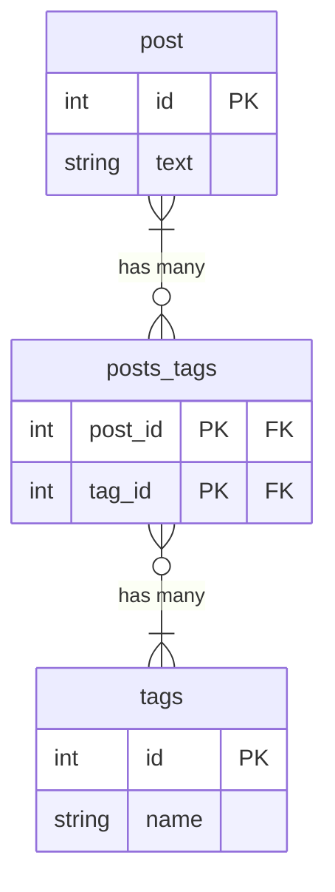

# 課題1

- 区切り文字が自明でない
  - カンマ、パイプ、半角スペースなど、どの文字で区切るのかを制約できない
  - ある箇所の処理ではカンマで区切り、ある箇所の処理ではパイプで区切っていた場合、データに不整合が生じる
    - その結果、本来は2個のデータが1個となる、元のタグ名を取得できないなどの問題が発生する
- 更新の影響範囲が全タグに及ぶ
  - 1個だけ削除するとしても、全タグを対象に更新する形になる
    - "A, B, C" のタグがあり、C を削除するとする
    - "A, B" で UPDATE する必要があり、関係ない A と B も (同じカラムなので) 書き換え対象となっている
- 値が重複する可能性がある
  - 値の重複が可能である
  - DB 制約で値の重複を防ぐことができない
- DB からのタグの一括削除が複雑
  - たとえば "B" のタグをテーブルから全削除する場合、タグが含まれいるか調べ、"B" を除外し、更新する必要がある
  - カラムを分けていれば WHERE 絞り込みで簡単に DELETE できる
    - もしくは tags テーブルの FK にしていれば、CASCADE 制約で簡単に削除できる
- タグの使用数の算出が複雑
  - "A" が付与されているレコード数を算出する場合、検索 or 絞り込みしてから count する必要がある

# 課題2

# 課題3

- 1対多 or 多対多 の関係性で、かつ片方のエンティティが1つのカラムで表現可能なとき
  - ブログサービスの記事のタグ
  - EC サイトの商品のカテゴリー
  - 施設予約サイトの宿泊プランの特徴