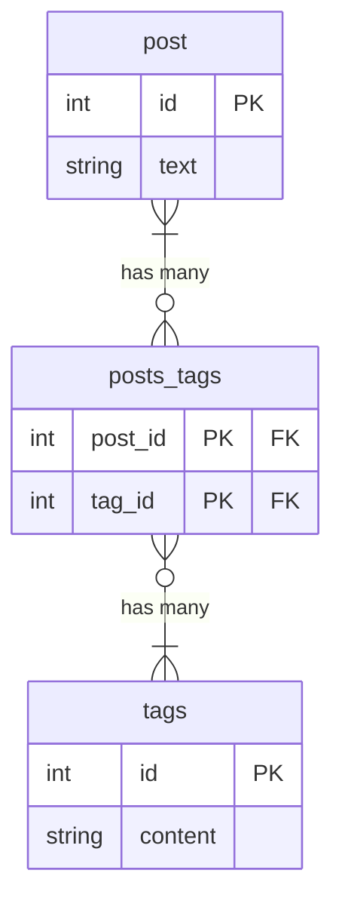

# 課題1

- 紐付いているタグ数の取得が複雑
- 4つ以上のタグを指定できない
- 最大タグ数を変更するためにテーブル構造の変更が必要
  - Alter 文 という間違えた場合の影響範囲が広い処理を行うことになる

# 課題2

# 課題3

DB アンチパターン1 と同様

- 1対多 or 多対多 の関係性で、かつ片方のエンティティが1つのカラムで表現可能なとき
  - ブログサービスの記事のタグ
  - EC サイトの商品のカテゴリー
  - 施設予約サイトの宿泊プランの特徴
