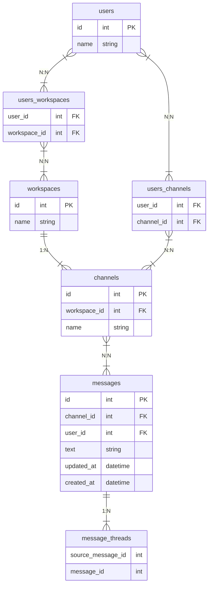

# 課題1

### 回答

### テーブル構成

仕様の解釈として、メッセージの投稿内容はテキストのみとしています。




#### 横断機能

```sql
-- ユーザーが所属するチャネル内の全メッセージを取得
SELECT m.*, m2.*
FROM user_channels uc
    JOIN channels c 
        ON uc.channel_id = c.id
    JOIN message m
        ON c.id = m.channel_id
    LEFT OUTER JOIN message_threads mt
        ON m.id = mt.source_message_id
    JOIN message m2
        ON mt.message_id = m2.id
WHERE uc.user_id = 1
    AND (m.text LIKE '%検索文字%' OR mt.text LIKE '%検索文字%')
;
```


### SQL メモ

```sql
--  メッセージ1のスレッドを取得
SELECt m.*
FROM message_threads mt
    JOIN message m
        ON mt.message_id = m.id
WHERE mt.source_message_id = 1
;

-- チャンネル1のスレッド以外のメッセージを取得
SELECT m.*
FROM message m
    LEFT OUTER JOIN message_threads mt
        ON m.id = mt.source_message_id
WHERE m.channel_id = 1
;

-- チャンネル1のスレッドも含む全メッセージを取得
SELECT m.*, mt.*
FROM message m
    LEFT OUTER JOIN message_threads mt
        ON m.id = mt.source_message_id
    JOIN message m2
        ON mt.message_id = m2.id
WHERE m.channel_id = 1
;
```


### 考えたこと

- メッセージとスレッドメッセージの関係を表現する際に、1つのテーブルで表現するか？中間テーブルを用意するか？


- メッセージが増えたときの大量データによる検索性能低下問題をどう考慮するか？