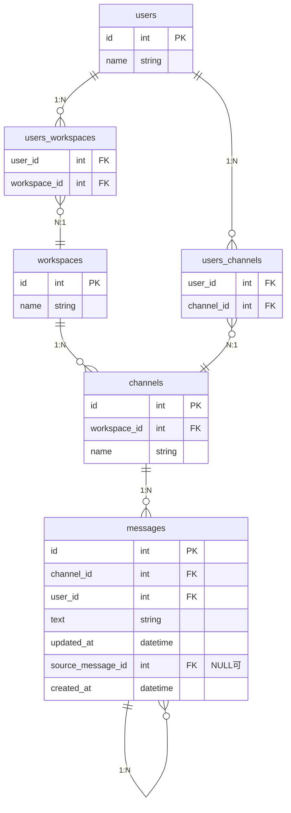

# 課題1

### 回答

### テーブル構成

仕様の解釈として、メッセージの投稿内容はテキストのみとしています。




#### 横断機能

```sql
-- ユーザーが所属するチャネル内の全メッセージを取得し、検索文字を含むものに絞り込み
SELECT m.*
FROM user_channels uc
    JOIN channels c 
        ON uc.channel_id = c.id
    JOIN message m
        ON c.id = m.channel_id
WHERE uc.user_id = 1
    AND m.text LIKE '%検索文字%'
;
```


### SQL メモ

```sql
-- チャネル1のスレッドも含む全メッセージを取得
SELECT *
FROM message
WHERE channel_id = 1
;

--  メッセージ1のスレッドメッセージを取得
SELECt *
FROM message
WHERE channel_id = 1
    source_message_id = 1
;

-- チャネル1のスレッド以外のメッセージを取得
SELECT *
FROM message
WHERE channel_id = 1
    AND source_message_id IS NULL
;
```


### 考えたこと

- メッセージとスレッドメッセージを同じテーブルにした意図
  - メッセージもスレッドメッセージも「1つのメッセージ」として概念上は同じモノであると考えた
  - 全メッセージを対象とした検索が行いやすい

- メッセージとスレッドメッセージの関係を表現する際に、1つのテーブルで表現するか？中間テーブルを用意するか？
  - 結論
    - 1つのテーブルで表現する
  - 理由
    - パフォーマンスへの影響が大きいと感じたため
      - メッセージは数が多い
    - 1つのテーブル
      - メリット
        - JOIN コストの軽減
      - デメリット
        - 責務の重複 (データ表現 + 関係性表現)
    - 中間テーブル
      - メリット
        - レコード削除の整合性担保 (ON DELETE CASCADE 制約)
      - デメリット
        - JOIN コストの増加
