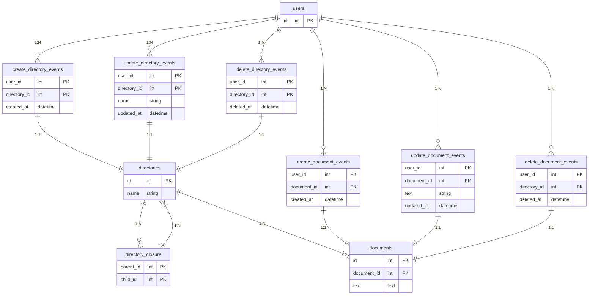
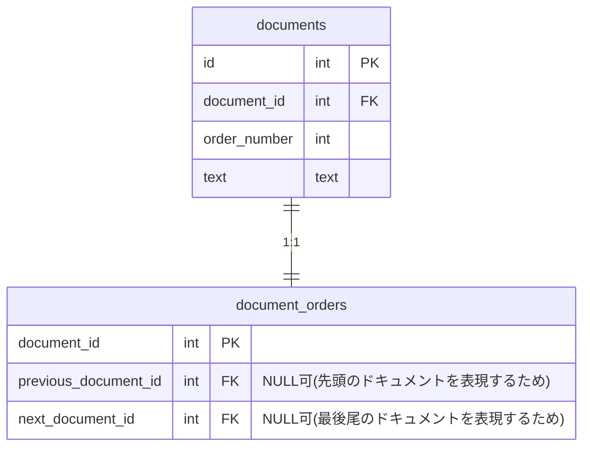

# 課題1

### 回答

### テーブル説明

- users: ユーザー
- directory_XXX_events: ディレクトリのイベント
- directories: ディレクトリ
- directory_closure: ディレクトリの閉包テーブル
- document_XXX_events: ドキュメントのイベント
- documents: ドキュメント

### 考えたこと

- イベントテーブルをCRUDごとに複数持つか？1つにまとめてフラグで区別するか？
    - 結論
        - わける
    - 理由
        - イベントが異なるため
        - 1つのテーブルで管理するデメリット
            - NULLカラム
                - イベントごとに保存したい情報が違った場合、他のイベントでは NULL となるカラムが発生する
            - 何でもテーブルになりがち
                - とりあえず対象に関するイベントは全部入れる運用になるリスクがある

# 課題2

## ディレクトリ内のドキュメントの順番を変更できる

### 回答

### 考えたこと

ドキュメントテーブルに順番を表現する数値カラムを追加する。 イベントテーブルは作成しない

- ドキュメントの順番をどのように表現するか？
    - 連番で表現する
        - 入れ替えの変更が複数レコードに渡る
    - 何かしらの time 系で表現する
        - 上手く表現できれば、入れ替えの変更レコード数を小さくできるかも
    - 別テーブルで連番で表現する
        - あまり意味はない
    - ディレクトリテーブルに配列型を持つ
        - 第一正規形に反する
    - New!! 双方向リストを持つ
- 考えるべきリスクは何か？
    - 順番を入れ替えるときのコスト
    - 他のディレクトリへ移動させるときのコスト
- 入れ替えたときのイベントもテーブルとして表現すべきか？
    - どのように表現したらいい？
    - このイベントは重要か？
    - 全イベントを表現すべきか、重要なもののみに絞るべきか？

## 順番はユーザー間で共有される

順番はドキュメントに保持しているため、前課題の構成から変更はない

## food for thought

のちほど追記