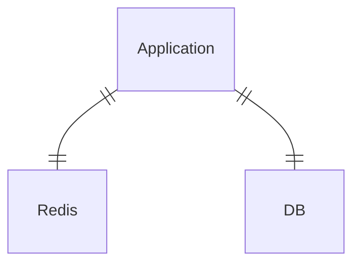
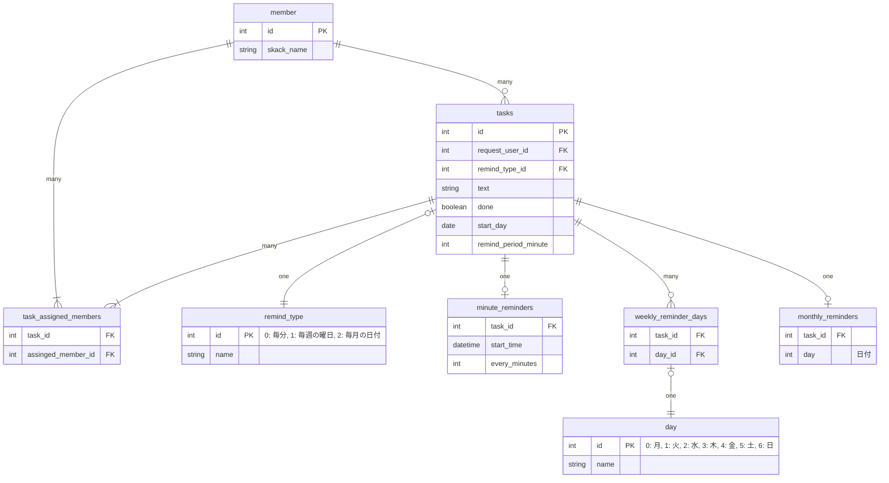

# 課題1

### 仕様

今回は以下の仕様としました

- リマンドメッセージは Slack アプリケーションの DM で送信する
- 毎週の曜日ごとのリマンドでは、複数の曜日を指定できる
- 毎月の日付ごとのリマンドでは、1つの日付のみを指定できる
- X日ごと、毎週X曜日ごと、毎月X日ごとのリマインドでは時間の指定はできない
  - 9:00 固定でリマンドする
- リマンドの開始時刻は指定できない

### 回答

システム構成は次の通りです。



テーブル構成は次の通りです。



### システムの説明

Redis を追加しました。「送信日時に対する送信対象のタスクID」の情報をDBに保存することに違和感があるためです。

- Redis
  - 補助的なデータを保持する
  - リマンド送信日時ごとのタスクIDを保持する
- DB
  - 事実を保存する
  - タスクの内容やリマンド方式を保存する

Redis では `{"リマンド送信日時": "送信対象のタスクIDのリスト"}` となるようにデータを保存します。

```json
{
  "2022-09-10 09:00:00": ["1", "2", "3"],
  "2022-09-10 10:00:00": ["1"],
  "2022-09-10 11:00:00": ["1", "3"],
  ...
}
```

バッチでタスクを取得する際の流れは以下になります。

1. Redis から現在時刻をキーにして、送信対象のタスクID一覧を取得
2. DB からタスクIDに一致するタスクを取得
3. アプリケーションでタスクのアサインメンバーに対してリマンドを送信

新規にタスクを追加する際の流れは以下になります。

1. Redis にリマインド送信日時をキーにして、タスクIDを追加 (10年先くらいまで入れる、`RPOP` コマンド & Mass Insert)
2. DB にタスクのデータを保存

既存のタスクが更新された際の流れは以下になります。

1. Redis から更新前のリマンド送信日時のキーから、更新タスクIDを削除 (`LREM` コマンド & Mass Insert)
2. Redis にリマインド送信日時をキーにして、タスクIDを追加 (10年先くらいまで入れる、`RPOP` コマンド & Mass Insert)
3. DB のタスクのデータを更新

### テーブルの説明

- member: メンバー
- tasks: タスク
- task_assigned_members: タスクとアサインされたメンバーの中間テーブル
- remind_type: リマインドの種類
- minute_reminders: 毎分ごとのリマインド
  - X分ごと、X時間ごと、毎日、X日ごと、X週ごとを表現する
  - 1時間ごとだと 60min、毎日だと 1440min、1週間ごとだと 10080min の値を設定する
- weekly_reminder_days: 毎週の曜日ごとのリマインド
  - 毎週X曜日ごと、毎週平日ごと、毎週X,Y,Z...曜日ごとを表現する
  - 曜日は複数指定できる
- monthly_reminders: 毎月の日付ごとのリマインド
  - 毎月X日ごとを表現する
- day: 曜日

### 考えたこと

- Slack のワークスペース情報、チャンネル情報を保持する必要があるか
  - 結論
    - 不要
  - 理由
    - サービスの概要を見る限り、Slack アプリケーションから直接DMを送っているように見えるため
- ユーザーの命名を何にするか？
  - 結論
    - member とする
  - 理由
    - Slack のドメイン領域で使用されている用語と合わせるため
      - 前提として、本アプリはビジネス上 Slack 以外の展開の可能性は低いとした
- 曜日ごとのリマンドテーブルで、曜日を Enum テーブルに切り出すかどうか？
  - 結論
    - 切り出す
  - 理由
    - 正規化するため
      - 正直切り出さなくても良いが、できるかぎり正規化してみる
- タスクとリマンドタイプの関係を、テーブル上どのように表現するか？
  - 結論
    - リマンドタイプごとにテーブルを用意する
  - 理由
    - 正規化するため
      - すべてタスクテーブルに集めると、NULL となるカラムが出てくる
      - リマンドタイプごとにテーブルが増えるデメリットがあるが、正規化してみる
- バッチでどのようにタスクを取得するか？
  - 結論
    - Redis を追加して設計してみる
  - 案
    - DB のタスクテーブルに次のリマンド送信時間を保持する
      - テーブルへの更新回数が激的に多くなる
    - DB にリマインド送信予定テーブルを追加
      - RDB でやることじゃない気がする、、、それこそ KVS とか
    - Redis に1時間ごとのリマンド送信タスクをキャッシュする
      - (Cons) 更新した場合の同期コストがかかる？
- Redis にどのような形式でデータを保持するか
  - 結論
    - リスト型
  - 理由
    - 1件取得の計算量は O(1) のため
      - 部分一致検索や全件検索ではなく、1件取得で取れるようにしたいです
      - 大量データアクセスによるパフォーマンス低下を危惧しています
        - 10年分のキーを保存すると 8.8万件 (1時間ごと送信だと `24 * 365 * 10 = 87600`) のデータとなる

### 追加仕様

- リマンドの開始時刻を指定できるようにしたい
  - タスクテーブルに開始時刻を表すカラムを追加する

