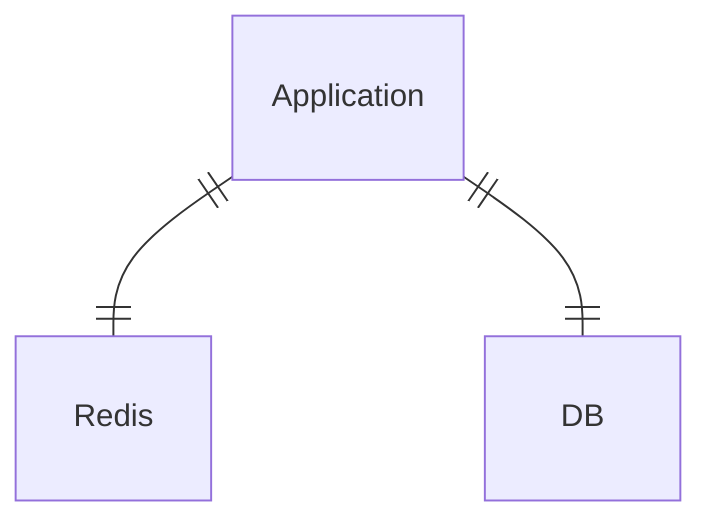
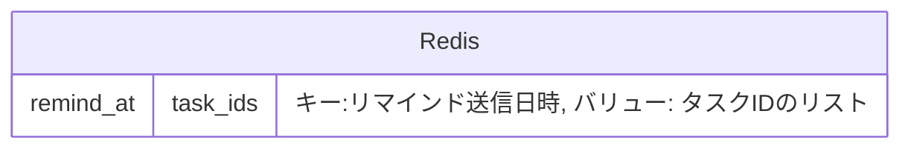
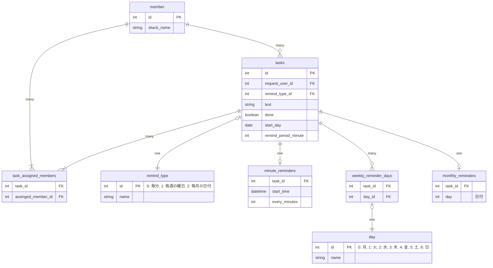

<!-- START doctoc generated TOC please keep comment here to allow auto update -->
<!-- DON'T EDIT THIS SECTION, INSTEAD RE-RUN doctoc TO UPDATE -->

- [課題1](#%E8%AA%B2%E9%A1%8C1)
    - [仕様](#%E4%BB%95%E6%A7%98)
    - [回答](#%E5%9B%9E%E7%AD%94)
      - [システム構成](#%E3%82%B7%E3%82%B9%E3%83%86%E3%83%A0%E6%A7%8B%E6%88%90)
      - [Redis構成](#redis%E6%A7%8B%E6%88%90)
      - [テーブル構成](#%E3%83%86%E3%83%BC%E3%83%96%E3%83%AB%E6%A7%8B%E6%88%90)
    - [システムの説明](#%E3%82%B7%E3%82%B9%E3%83%86%E3%83%A0%E3%81%AE%E8%AA%AC%E6%98%8E)
      - [Redis の役割](#redis-%E3%81%AE%E5%BD%B9%E5%89%B2)
      - [Redis を導入する理由](#redis-%E3%82%92%E5%B0%8E%E5%85%A5%E3%81%99%E3%82%8B%E7%90%86%E7%94%B1)
      - [バッチでリマンド処理](#%E3%83%90%E3%83%83%E3%83%81%E3%81%A7%E3%83%AA%E3%83%9E%E3%83%B3%E3%83%89%E5%87%A6%E7%90%86)
      - [タスクの追加](#%E3%82%BF%E3%82%B9%E3%82%AF%E3%81%AE%E8%BF%BD%E5%8A%A0)
      - [タスクの更新](#%E3%82%BF%E3%82%B9%E3%82%AF%E3%81%AE%E6%9B%B4%E6%96%B0)
    - [テーブルの説明](#%E3%83%86%E3%83%BC%E3%83%96%E3%83%AB%E3%81%AE%E8%AA%AC%E6%98%8E)
    - [考えたこと](#%E8%80%83%E3%81%88%E3%81%9F%E3%81%93%E3%81%A8)
    - [追加仕様](#%E8%BF%BD%E5%8A%A0%E4%BB%95%E6%A7%98)
- [感想](#%E6%84%9F%E6%83%B3)

<!-- END doctoc generated TOC please keep comment here to allow auto update -->

# 課題1

### 仕様

今回は以下の仕様としました

- リマンドメッセージは Slack アプリケーションの DM で送信する
- 毎週の曜日ごとのリマンドでは、複数の曜日を指定できる
- 毎月の日付ごとのリマンドでは、1つの日付のみを指定できる
- X日ごと、毎週X曜日ごと、毎月X日ごとのリマインドでは時間の指定はできない
  - 9:00 固定でリマンドする
- リマンドの開始時刻は指定できない

### 回答

#### システム構成



#### Redis構成



#### テーブル構成



### システムの説明

#### Redis の役割

アプリケーションと DB の他に Redis を追加しました。
DB モデリングの範囲に入るか微妙ですが、全体の設計からは導入した方が良いと感じました。

Redis と DB の役割の分担は以下のように考えています。

- DB
  - 事実を保存する
  - タスクの内容やユーザーが設定したリマンド方式を保存する
- Redis
  - 補助的なデータを保持する
  - リマンド送信日時ごとのタスクIDを保持する

Redis では key: value が `"リマンド送信日時": "送信対象のタスクIDのリスト"` となるようにデータを保存します。

```
"member_ids_to_remind_at_2022-09-10_09:00:00": ["1", "2", "3"]
"member_ids_to_remind_at_2022-09-10_10:00:00": ["1"]
"member_ids_to_remind_at_2022-09-10_11:00:00": ["1", "3"]
...
```

※キーに「~にリマンドされるメンバーID」の接頭辞を付与している理由は、アプリケーションの他のキャッシュデータと区別できるようにするためです。

#### Redis を導入する理由

データのキャッシュを保存し、アプリケーションの処理を高速化するためです。
なぜ高速化が必要なのかの背景から説明した文章が以下です。

- バッチ処理のタスク取得 ~ リマンド送信までの時間をなるべく小さくしたい
  - ビジネス的に重要であると仮定した非機能要件
    - ユーザーのリマンド設定時刻と実際のサーバーのリマンド送信時刻の差分を小さくしたい
  - ビジネスがスケールしてもシステムが耐えられるようにしたい
    - ユーザー数が増えても、リマンド周期の最小単位の設定が小さくなっても非機能要件を満たしたい
    - つまりスケールに伴う実リマインド送信時刻の乖離を小さくしたい
- 「送信日時に対する送信対象タスクIDのリスト」の取得時間をできるだけ早くしたい
  - 全体から見てこの処理がボトルネックとなる
  - このタスクIDのリストが取れさえすれば、後は非同期処理でSlack API 叩く(リマインドを送信する)だけ
- Redis により高速化する
  - KVS の特性
    - 単一キー指定であればいかなる条件でも高速に値を取得できる特性を持つ
      - 100万件のデータの中からでも一瞬で取れる
    - 部分一致取得や全件取得で指定する場合は、条件に応じて遅くなる
      - KVS のデータ件数やデータ量が増えれば遅くなる
- Redis 導入により、全体的な構成がシンプルになる
  - DB は事実となるデータを保存することに集中できる
  - Redis はアプリケーション処理高速化のために必要なデータをキャッシュすることに集中する
    - つまるところこのデータが「送信日時に対する送信対象タスクIDのリスト」である

#### バッチでリマンド処理

1. Redis から現在時刻をキーにして、送信対象のタスクID一覧を取得
2. DB からタスクIDに一致するタスクを取得
3. アプリケーションでタスクのアサインメンバーに対してリマンドを送信

#### タスクの追加

1. Redis にリマインド送信日時をキーにして、タスクIDを追加 (10年先くらいまで入れる、`RPOP` コマンド & Mass Insert)
2. DB にタスクのデータを保存

#### タスクの更新

1. Redis から更新前のリマンド送信日時のキーから、更新タスクIDを削除 (`LREM` コマンド & Mass Insert)
2. Redis にリマインド送信日時をキーにして、タスクIDを追加 (10年先くらいまで入れる、`RPOP` コマンド & Mass Insert)
3. DB のタスクのデータを更新

### テーブルの説明

- member: メンバー
- tasks: タスク
- task_assigned_members: タスクとアサインされたメンバーの中間テーブル
- remind_type: リマインドの種類
- minute_reminders: 毎分ごとのリマインド
  - X分ごと、X時間ごと、毎日、X日ごと、X週ごとを表現する
  - 1時間ごとだと 60min、毎日だと 1440min、1週間ごとだと 10080min の値を設定する
- weekly_reminder_days: 毎週の曜日ごとのリマインド
  - 毎週X曜日ごと、毎週平日ごと、毎週X,Y,Z...曜日ごとを表現する
  - 曜日は複数指定できる
- monthly_reminders: 毎月の日付ごとのリマインド
  - 毎月X日ごとを表現する
- day: 曜日

### 考えたこと

- Slack のワークスペース情報、チャンネル情報を保持する必要があるか
  - 結論
    - 不要
  - 理由
    - サービスの概要を見る限り、Slack アプリケーションから直接DMを送っているように見えるため
- ユーザーの命名を何にするか？
  - 結論
    - member とする
  - 理由
    - Slack のドメイン領域で使用されている用語と合わせるため
      - 前提として、本アプリはビジネス上 Slack 以外の展開の可能性は低いとした
- 曜日ごとのリマンドテーブルで、曜日を Enum テーブルに切り出すかどうか？
  - 結論
    - 切り出す
  - 理由
    - 正規化するため
      - 正直切り出さなくても良いが、できるかぎり正規化してみる
- タスクとリマンドタイプの関係を、テーブル上どのように表現するか？
  - 結論
    - リマンドタイプごとにテーブルを用意する
  - 理由
    - 正規化するため
      - すべてタスクテーブルに集めると、NULL となるカラムが出てくる
      - リマンドタイプごとにテーブルが増えるデメリットがあるが、正規化してみる
- バッチでどのようにタスクを取得するか？
  - 結論
    - Redis を追加して設計してみる
  - 案
    - DB のタスクテーブルに次のリマンド送信時間を保持する
      - テーブルへの更新回数が激的に多くなる
    - DB にリマインド送信予定テーブルを追加
      - RDB でやることじゃない気がする、、、それこそ KVS とか
    - Redis に1時間ごとのリマンド送信タスクをキャッシュする
      - (Cons) 更新した場合の同期コストがかかる？
- Redis にどのような形式でデータを保持するか
  - 結論
    - リスト型
  - 理由
    - 1件取得の計算量は O(1) のため
      - 部分一致検索や全件検索ではなく、1件取得で取れるようにしたい
        - O(1) であれば何万件データがあっても一瞬で取得できる
      - 大量データアクセスによるパフォーマンス低下を危惧しています
        - 10年分のキーを保存すると 8.8万件 (1時間ごと送信だと `24 * 365 * 10 = 87600`) のデータとなる
        - 将来的に15分ごと、1分ごとに設定できるとするとその数は4倍、60倍に増える
        - Redis だと Expire を設定して古いキーを削除することが可能

### 追加仕様

- リマンドの開始時刻を指定できるようにしたい
  - タスクテーブルに開始時刻を表すカラムを追加する
- リマンドの最小周期を1分毎にしたい
  - 現状の構成から変更なし
  - 1分事のリマンドを設定されてもスケール可能な構成になっている

# 感想

- 本課題では、過去に似たシステムを作成した経験が役になった
  - 作ったシステム
    - [当日の天気予報を LINE に送信するアプリ](https://github.com/HirotoOhria/UmbrellaNotice) 
  - 動作の細部をイメージできる
    - メッセージの送信はバッチ処理を起点とする
    - メッセージの送信は非同期処理で行う
  - 落とし穴を知っている
    - ユーザーが設定した時刻と実際の送信処理がズレる
    - データ量がとても多くなるので設計上考慮する必要がある
      - DB アクセスに時間がかかる
      - アプリケーションの繰り返し処理に時間がかかる
