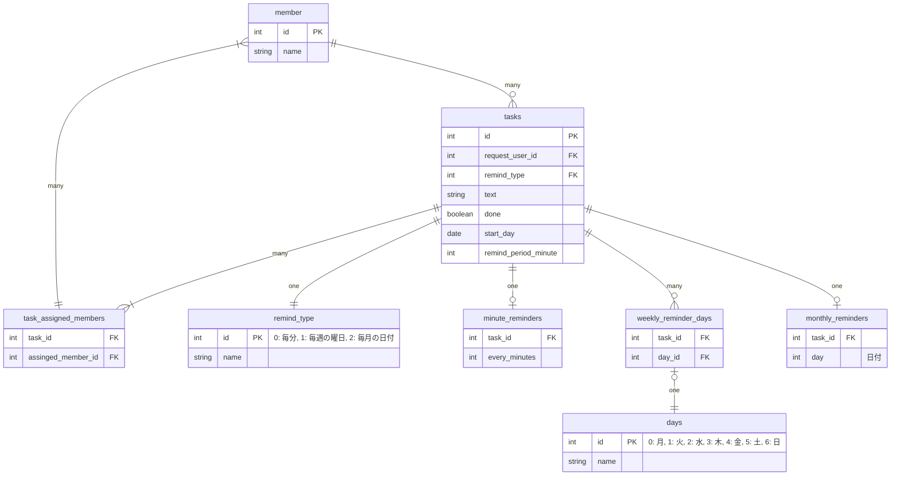

# 課題1

### 仕様

今回は以下の仕様としました

- 毎週の曜日ごとのリマンドでは、複数の曜日を指定できる
- 毎月の日付ごとのリマンドでは、1つの日付のみを指定できる
- X日ごと、毎週X曜日ごと、毎月X日ごとのリマインドでは時間の指定はできない
  - 9:00 固定でリマンドする
- リマンドの開始時刻は指定できない

### 回答

- 今気づいていること
  - Batch でリマンド対象のタスクを取ってくるクエリを考えられていない
  - 後で時間取って修正します🙇‍♂️

### テーブルの説明

- member: メンバー
- tasks: タスク
- task_assigned_members: タスクとアサインされたメンバーの中間テーブル
- remind_type: リマインドの種類
- minute_reminders: 毎分ごとリマインド
  - X分ごと、X時間ごと、毎日、X日ごと、X週ごとを表現する
- weekly_reminder_days: 毎週の曜日ごとリマインド
  - 毎週X曜日ごと、毎週平日ごと、毎週X曜日とX曜日と...ごとを表現する
  - 曜日は複数指定できる
- monthly_reminders: 毎月の日付ごとリマインド
  - 毎月X日ごとを表現する
- days: 曜日

### 考えたこと

- ユーザーの命名を何にするか？
  - 結論
    - member とする
  - 理由
    - Slack のドメイン領域で使用されている用語と合わせるため
      - 前提として、本アプリはビジネス上 Slack 以外の展開の可能性は低いとした
- 曜日ごとのリマンドテーブルで、曜日を Enum テーブルに切り出すかどうか？
  - 結論
    - 切り出す
  - 理由
    - 正規化するため
      - 正直切り出さなくても良いが、できるかぎり正規化してみる
- タスクとリマンドタイプの関係を、テーブル上どのように表現するか？
  - 結論
    - リマンドタイプごとにテーブルを用意する
  - 理由
    - 正規化するため
      - すべてタスクテーブルに集めると、NULL となるカラムが出てくる
      - リマンドタイプごとにテーブルが増えるデメリットがあるが、正規化してみる

### 追加仕様

- リマンドの開始時刻を指定できるようにしたい
  - 各リマンドタイプのテーブルに、開始時刻を表すカラムを追加する

