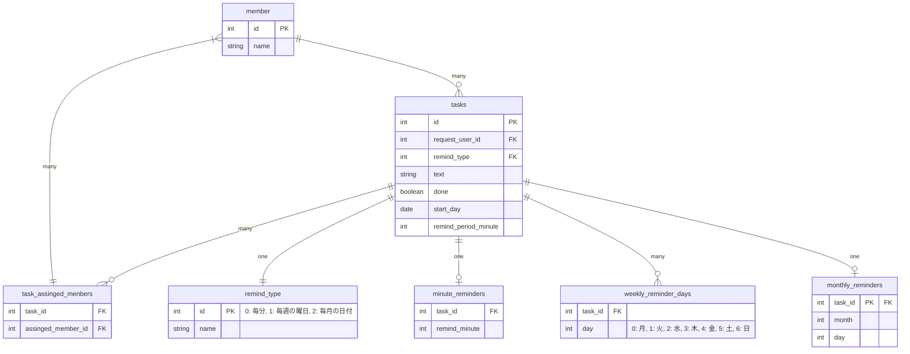

# 課題1

### 回答

```mermaid
erDiagram

member ||--o{ tasks : "many"
member }|--|| task_assinged_menbers : "many"
member {
  int id PK
  string name
}

tasks ||--o{ task_assinged_menbers : "many"
tasks ||--|| remind_type : "one"
tasks ||--o| minute_reminders : "one"
tasks ||--o{ weekly_reminder_days : "many"
tasks ||--o| monthly_reminders : "one"
tasks {
  int id PK
  int request_user_id FK
  int remind_type FK
  string text
  boolean done
  date start_day
  int remind_period_minute
}

task_assinged_menbers {
  int task_id FK
  int assinged_member_id FK 
}

remind_type {
  int id PK "0: 毎分, 1: 毎週の曜日, 2: 毎月の日付"
  string name
}

minute_reminders {
  int task_id FK
  int remind_minute
}

weekly_reminder_days {
  int task_id FK
  int day "0: 月, 1: 火, 2: 水, 3: 木, 4: 金, 5: 土, 6: 日"
}

monthly_reminders {
  int task_id PK "FK"
  int month 
  int day
}
```

### 考えたこと
