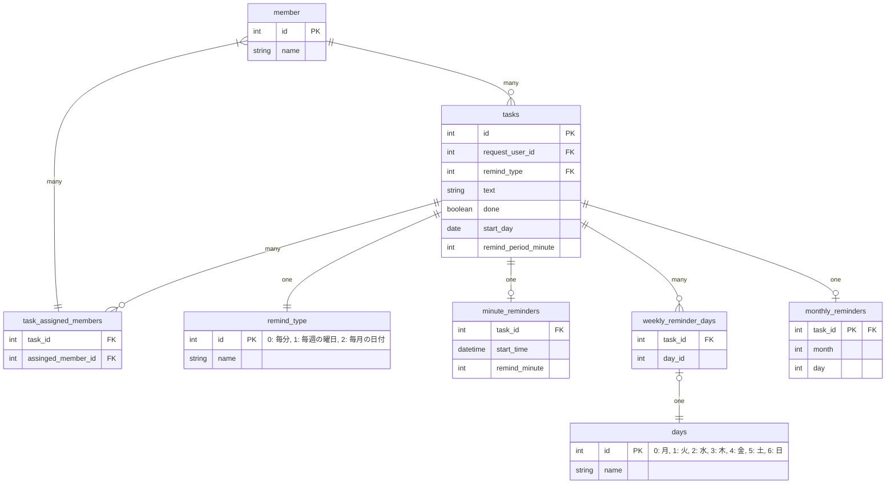

# 課題1

### 回答

### テーブルの説明

- member: メンバー
- tasks: タスク
- task_assigned_members: タスクとアサインされたメンバーの中間テーブル
- remind_type: リマインドの種類
- minute_reminders: 毎分ごとリマインド
  - X分ごと、X時間ごと、毎日、X日ごと、X週ごとを扱う
- weekly_reminder_days: 毎週の曜日ごとリマインド
  - 毎週X曜日ごと、毎週平日ごと、毎週X曜日とX曜日と...ごとを扱う
  - 曜日は複数指定できる
- monthly_reminders: 毎月の日付ごとリマインド
  - 毎月X日ごとを扱う
  - 仕様として毎月のリマンドでは単一日のみの指定としました

### 考えたこと

- ユーザーの命名を何にするか？
  - 結論
    - member とする
  - 理由
    - Slack のドメインで使用されている用語と合わせるため
      - 前提として、本アプリはビジネス上 Slack 以外の展開の可能性は低いとした
- 曜日ごとのリマンドテーブルで、曜日を Enum テーブルに切り出すかどうか？
  - 結論
    - 切り出す
  - 理由
    - 正規化するため
      - 正直切り出さなくても良いが、できるかぎり正規化してみる
- タスクとリマンドタイプの関係を、テーブル上どのように表現するか？
  - 結論
    - リマンドタイプごとにテーブルを用意する
  - 理由
    - 正規化するため
      - すべてタスクテーブルに集めると、NULL となるカラムが出てくる
      - リマンドタイプごとにテーブルが増えるデメリットがあるが、正規化してみる
