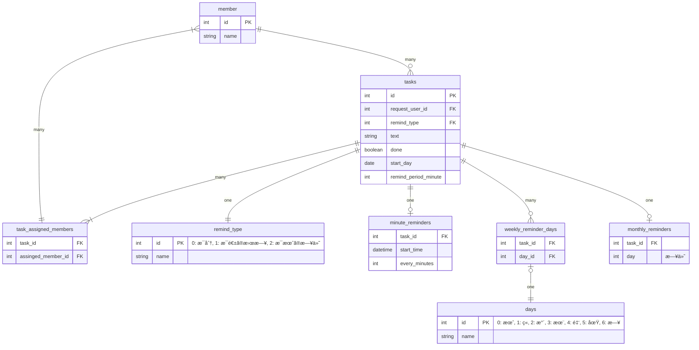

# 課題1

### 仕様

今å›ã¯ä»¥ä¸‹ã®ä»•æ§˜ã¨ã—ã¾ã—ãŸ

- æ¯é€±ã®æ›œæ—¥ã”ã¨ã®ãƒªãƒãƒ³ãƒ‰ã§ã¯ã€è¤‡æ•°ã®æ›œæ—¥ã‚’指定ã§ãã‚‹
- æ¯æœˆã®æ—¥ä»˜ã”ã¨ã®ãƒªãƒãƒ³ãƒ‰ã§ã¯ã€1ã¤ã®æ—¥ä»˜ã®ã¿ã‚’指定ã§ãã‚‹
- Xæ—¥ã”ã¨ã€æ¯é€±X曜日ã”ã¨ã€æ¯æœˆXæ—¥ã”ã¨ã®ãƒªãƒã‚¤ãƒ³ãƒ‰ã§ã¯æ™‚é–“ã®æŒ‡å®šã¯ã§ããªã„
  - 9:00 固定ã§ãƒªãƒãƒ³ãƒ‰ã™ã‚‹
- リãƒãƒ³ãƒ‰ã®é–‹å§‹æ™‚刻ã¯æŒ‡å®šã§ããªã„

### å›ç­”

- 今気ã¥ã„ã¦ã„ã‚‹ã“ã¨
  - Batch ã§ãƒªãƒãƒ³ãƒ‰å¯¾è±¡ã®ã‚¿ã‚¹ã‚¯ã‚’å–ã£ã¦ãるクエリを考ãˆã‚‰ã‚Œã¦ã„ãªã„
  - 後ã§æ™‚é–“å–ã£ã¦ä¿®æ­£ã—ã¾ã™ğŸ™‡â€â™‚ï¸

```mermaid
erDiagram

member ||--o{ tasks : "many"
member }|--|| task_assigned_members : "many"
member {
  int id PK
  string name
}

tasks ||--|{ task_assigned_members : "many"
tasks ||--|| remind_type : "one"
tasks ||--o| minute_reminders : "one"
tasks ||--o{ weekly_reminder_days : "many"
tasks ||--o| monthly_reminders : "one"
tasks {
  int id PK
  int request_user_id FK
  int remind_type FK
  string text
  boolean done
  date start_day
  int remind_period_minute
}

task_assigned_members {
  int task_id FK
  int assinged_member_id FK 
}

remind_type {
  int id PK "0: æ¯åˆ†, 1: æ¯é€±ã®æ›œæ—¥, 2: æ¯æœˆã®æ—¥ä»˜"
  string name
}

minute_reminders {
  int task_id FK
  datetime start_time
  int every_minutes
}

weekly_reminder_days |o--|| days : "one"
weekly_reminder_days {
  int task_id FK
  int day_id FK
}

monthly_reminders {
  int task_id FK
  int day "日付"
}

days {
  int id PK "0: 月, 1: ç«, 2: æ°´, 3: 木, 4: 金, 5: 土, 6: æ—¥"
  string name
}
```

### テーブルã®èª¬æ˜

- member: メンãƒãƒ¼
- tasks: タスク
- task_assigned_members: タスクã¨ã‚¢ã‚µã‚¤ãƒ³ã•ã‚ŒãŸãƒ¡ãƒ³ãƒãƒ¼ã®ä¸­é–“テーブル
- remind_type: リãƒã‚¤ãƒ³ãƒ‰ã®ç¨®é¡
- minute_reminders: æ¯åˆ†ã”ã¨ã®ãƒªãƒã‚¤ãƒ³ãƒ‰
  - X分ã”ã¨ã€X時間ã”ã¨ã€æ¯æ—¥ã€Xæ—¥ã”ã¨ã€X週ã”ã¨ã‚’表ç¾ã™ã‚‹
  - 1時間ã”ã¨ã ã¨ 60minã€æ¯æ—¥ã ã¨ 1440minã€1週間ã”ã¨ã ã¨ 10080min ã®å€¤ã‚’設定ã™ã‚‹
- weekly_reminder_days: æ¯é€±ã®æ›œæ—¥ã”ã¨ã®ãƒªãƒã‚¤ãƒ³ãƒ‰
  - æ¯é€±X曜日ã”ã¨ã€æ¯é€±å¹³æ—¥ã”ã¨ã€æ¯é€±X,Y,Z...曜日ã”ã¨ã‚’表ç¾ã™ã‚‹
  - 曜日ã¯è¤‡æ•°æŒ‡å®šã§ãã‚‹
- monthly_reminders: æ¯æœˆã®æ—¥ä»˜ã”ã¨ã®ãƒªãƒã‚¤ãƒ³ãƒ‰
  - æ¯æœˆXæ—¥ã”ã¨ã‚’表ç¾ã™ã‚‹
- days: 曜日

### 考ãˆãŸã“ã¨

- ユーザーã®å‘½åを何ã«ã™ã‚‹ã‹ï¼Ÿ
  - çµè«–
    - member ã¨ã™ã‚‹
  - ç†ç”±
    - Slack ã®ãƒ‰ãƒ¡ã‚¤ãƒ³é ˜åŸŸã§ä½¿ç”¨ã•ã‚Œã¦ã„る用èªã¨åˆã‚ã›ã‚‹ãŸã‚
      - å‰æã¨ã—ã¦ã€æœ¬ã‚¢ãƒ—リã¯ãƒ“ジãƒã‚¹ä¸Š Slack 以外ã®å±•é–‹ã®å¯èƒ½æ€§ã¯ä½ã„ã¨ã—ãŸ
- 曜日ã”ã¨ã®ãƒªãƒãƒ³ãƒ‰ãƒ†ãƒ¼ãƒ–ルã§ã€æ›œæ—¥ã‚’ Enum テーブルã«åˆ‡ã‚Šå‡ºã™ã‹ã©ã†ã‹ï¼Ÿ
  - çµè«–
    - 切り出ã™
  - ç†ç”±
    - æ­£è¦åŒ–ã™ã‚‹ãŸã‚
      - 正直切り出ã•ãªãã¦ã‚‚良ã„ãŒã€ã§ãã‚‹ã‹ãã‚Šæ­£è¦åŒ–ã—ã¦ã¿ã‚‹
- タスクã¨ãƒªãƒãƒ³ãƒ‰ã‚¿ã‚¤ãƒ—ã®é–¢ä¿‚ã‚’ã€ãƒ†ãƒ¼ãƒ–ル上ã©ã®ã‚ˆã†ã«è¡¨ç¾ã™ã‚‹ã‹ï¼Ÿ
  - çµè«–
    - リãƒãƒ³ãƒ‰ã‚¿ã‚¤ãƒ—ã”ã¨ã«ãƒ†ãƒ¼ãƒ–ルを用æ„ã™ã‚‹
  - ç†ç”±
    - æ­£è¦åŒ–ã™ã‚‹ãŸã‚
      - ã™ã¹ã¦ã‚¿ã‚¹ã‚¯ãƒ†ãƒ¼ãƒ–ルã«é›†ã‚ã‚‹ã¨ã€NULL ã¨ãªã‚‹ã‚«ãƒ©ãƒ ãŒå‡ºã¦ãã‚‹
      - リãƒãƒ³ãƒ‰ã‚¿ã‚¤ãƒ—ã”ã¨ã«ãƒ†ãƒ¼ãƒ–ルãŒå¢—ãˆã‚‹ãƒ‡ãƒ¡ãƒªãƒƒãƒˆãŒã‚ã‚‹ãŒã€æ­£è¦åŒ–ã—ã¦ã¿ã‚‹

### 追加仕様

- リãƒãƒ³ãƒ‰ã®é–‹å§‹æ™‚刻を指定ã§ãるよã†ã«ã—ãŸã„
  - タスクテーブルã«é–‹å§‹æ™‚刻を表ã™ã‚«ãƒ©ãƒ ã‚’追加ã™ã‚‹

