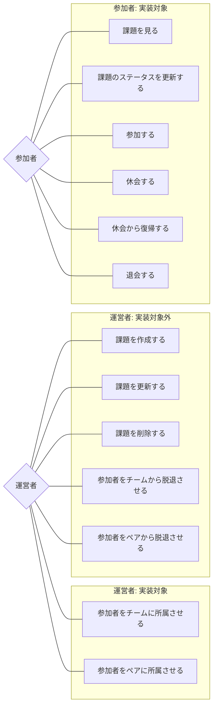
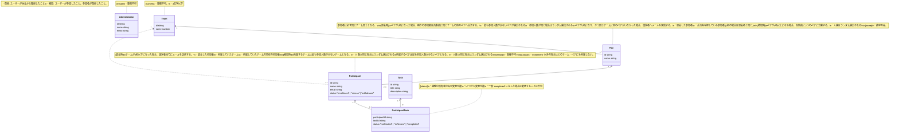

# 課題1

ユースケース図

```mermaid
flowchart LR

A{運営者}
P{参加者}

A --- A1[課題を作成する]
A --- A2[課題を更新する]
A --- A3[課題を削除する]
A --- A4[参加者をチームに所属させる]
A --- A5[参加者をチームから脱退させる]
A --- A6[参加者をペアに所属させる]
A --- A7[参加者をペアから脱退させる]

subgraph 運営者: 実装対象
    A4
    A6
end

subgraph 運営者: 実装対象外
    A1 
    A2
    A3
    A5
    A7
end


P --- P1[課題を見る]
P --- P2[課題のステータスを更新する]
P --- P3[参加する]
P --- P4[休会する]
P --- P5[休会から復帰する]
P --- P6[退会する]

subgraph 参加者: 実装対象
    P1
    P2
    P3
    P4
    P5
    P6
end
```

ドメインモデル図

```mermaid
classDiagram

note "・復帰: ユーザーが休会から復帰したこと\n・増加: ユーザーが参加したこと。参加者が復帰したこと。"

note for Administrator "[email]\n・重複不可"
class Administrator {
    id string
    name string
    email string
}

note for Participant "[退会時]\nチームが2名以下になった場合、運営者当てにメールを送信する。\n・退会した参加者\n・所属していたチーム\n・所属していたチームの現在の参加者\n\n[増加時]\n所属するチームは最も参加人数が少ないチームとなる。\n・人数が同じ場合はランダム選出される\n所属するペアは最も参加人数が少ないペアとなる。\n・人数が同じ場合はランダム選出される\n\n[email]\n・重複不可\n\n[status]\n・'enrollment' 以外の場合はどのチーム・ペアにも所属しない。"
class Participant {
    id string
    name string
    email string
    status "enrollment" | "recess" | "withdrawal"
}

note for Team "[name]\n・重複不可。\n・3文字以下"
class Team {
    id string
    name number
}

note for Pair "参加者は必ず同じチーム同士となる。\n\n[退会時]\nペアが1名になった場合、残りの参加者は自動的に同じチームの他のペアへ合流する。\n・最も参加人数が少ないペアが選出される\n・参加人数が同じ場合はランダム選出される\nペアが1名になり、かつ同じチームに他のペアがいなかった場合、運営者へメールを送信する。\n・退会した参加者\n・合流先を探している参加者 (1名の場合は退会者と同じ)\n\n[増加時]\nペアが4名以上になる場合、自動的に2つのペアに分割する。\n・人選はランダム選出される\n\n[name]\n・英字のみ。"
class Pair {
    id string
    name string
}

class Task {
    id string
    title string
    description string
}

note for ParticipantTask "[status]\n・課題の所有者のみが変更可能\n・いつでも変更可能\n・一度 'completed' になった場合は変更することは不可"
class ParticipantTask {
    participantId string
    taskId string
    status "notStarted" | "inReview" | "completed"
}

Team "1" <-- "1..*" Pair
Team "1" <.. "3..*" Participant
Pair "1" <-- "2..3" Participant
Task "1..*" <-- "0..*" ParticipantTask
Participant "1..*" <-- "0..*" ParticipantTask
```